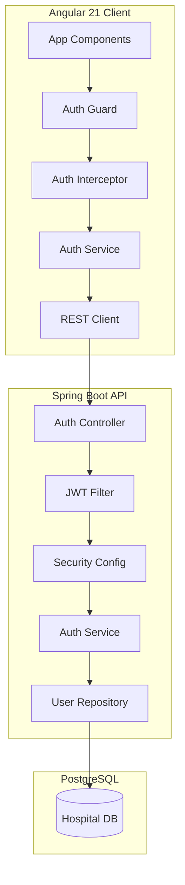

# Atlas Hospital Management System

Atlas Hospital is a state-of-the-art medical management platform designed for high-precision healthcare coordination. Built with a secure Spring Boot backend and a premium Angular frontend, it provides a centralized hub for patient records, secure NFC access cards, and staff management.

## 🏛️ System Architecture

The project follows a modern full-stack architecture with a clear separation between the data, logic, and presentation layers.



## 🚀 Tech Stack

### Backend
- **Framework**: Spring Boot 3.x
- **Security**: Spring Security with JWT (JSON Web Tokens)
- **Database**: PostgreSQL 15+
- **Persistence**: Spring Data JPA / Hibernate
- **Utility**: Lombok, Jakarta Validation

### Frontend
- **Framework**: Angular 21 (Standalone Components)
- **Styling**: Tailwind CSS 4.x (Premium Design System)
- **State Management**: RxJS & Observables
- **Theming**: Atlas Precision (Blue/Black/White)

---

## 🔐 Core Features

### 1. Advanced Authentication
- **Secure Onboarding**: Multi-role registration (DOCTOR, NURSE, ADMIN, STAFF).
- **JWT Protection**: Stateless session management with automatic token attachment via HTTP Interceptors.
- **Role-Based Access**: Specialized views and restricted navigation based on staff hierarchy.

### 2. Clinical Patient Records
- **Vitals Tracking**: Comprehensive database of enrolled patients with clinical identities.
- **Advanced Search**: Real-time filtering and search via clinical parameters.
- **Profile Management**: Rich tabular views for rapid record access and updates.

### 3. NFC Card Security
- **Digital Identity**: Stylized visual representations of physical hospital access cards.
- **3D Interaction**: Premium UI with 3D hover effects for card verification.
- **Life-cycle Management**: Ability to issue, rotate, and revoke cards digitally.

### 4. Personnel Directory
- **Staff Health**: Online status indicators and professional role tracking.
- **Administrative Control**: Advanced tools for managing medical practitioners and support staff.

---

## 🛠️ Development Setup

### Prerequisites
- JDK 21
- PostgreSQL 15+
- Node.js & npm (latest)
- Angular CLI (`npm install -g @angular/cli`)

### Backend Setup
1. Configure your database in `Backend/src/main/resources/application.properties`.
2. Run the application:
   ```bash
   cd Backend
   ./mvnw spring-boot:run
   ```

### Frontend Setup
1. Install dependencies:
   ```bash
   cd frontend
   npm install
   ```
2. Start the development server:
   ```bash
   ng serve
   ```
3. Access at `http://localhost:4200`

---

## 🚥 API Reference

| Method | Endpoint | Description | Auth Required |
| :--- | :--- | :--- | :--- |
| POST | `/api/auth/login` | Staff Authentication | ❌ No |
| POST | `/api/auth/register` | Staff Registration | ❌ No |
| GET | `/api/patients` | Fetch All Patient Records | ✅ Yes |
| POST | `/api/cards` | Issue New Access Card | ✅ Yes |
| GET | `/api/users` | List Staff Directory | ✅ Yes (Admin) |

---
*Created with precision for Atlas Hospital Medical Center.*
